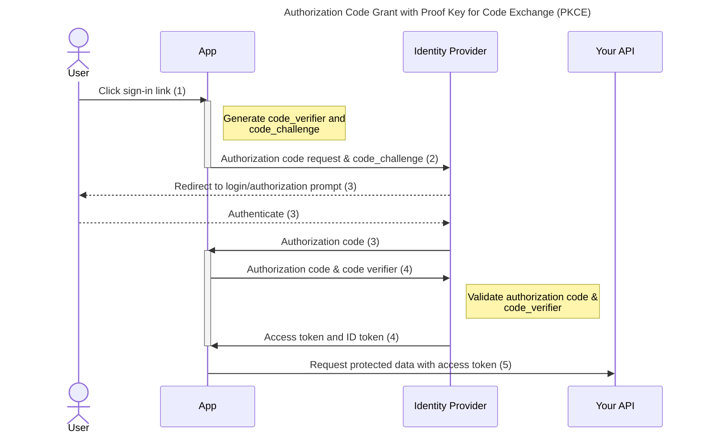

# web-client
This repository contains the user-facing frontend service for the minireipaz project. 

## Repo Structure

```
├── definitionsapi ##### OpenAPI
│   └── openapi.yaml
│
├── api #### vercel function dep api
│   └── index.go
│
├── internal
│   ├── common
│   │   └── ping.go
│   ├── config
│   │   └── envs.go ### load, set envs
│   ├── honeycomb
│   │   ├── honey_setup.go ##### initial setup
│   │   └── otel_setup.go
│   ├── middlewares
│   │   └── middle.go ## register middlewares
│   ├── routes
│   │   └── routes.go
│   ├── users
│   │   └── name.go
│   └── vaults
│       ├── setup_vaults.go
│       ├── vault_hashi.go
│       └── vault_redis.go
│
├── scripts ### scripts to automate tasks
│   ├── lint.sh
│   ├── openapi-http.sh
│   ├── run_code.sh
│   └── test.sh
│
├── tests ### testing for vercel function
│   ├── name_test.go
│   └── ping_test.go
│
├── go.mod ### for vercel function
├── go.sum ### for vercel function
│
├── gover.coverprofile
│
├── localmain.go
├── Makefile
│
│
│ ################### react ######################
├── dist ####### DIST react
│   ├── assets
│   │   ├── index-DiwrgTda.css
│   │   ├── index-DVoHNO1Y.js
│   │   └── react-CHdo91hT.svg
│   ├── index.html
│   └── vite.svg
│
├── src
│   ├── App.css
│   ├── App.tsx
│   ├── assets
│   │   └── react.svg
│   ├── authConfig.ts ####### config auth provider
│   ├── components
│   │   ├── AuthProvider
│   │   │   └── indexAuthProvider.tsx ### Context
│   │   ├── Callback
│   │   │   └── indexCallback.tsx 
│   │   ├── Dashboard
│   │   │   └── indexDashboard.tsx
│   │   ├── Header
│   │   │   └── indexHeader.tsx
│   │   ├── Login
│   │   │   └── indexLogin.tsx
│   │   └── Logout
│   │       └── indexLogout.tsx
│   ├── index.css
│   ├── main.tsx
│   └── vite-env.d.ts
│
├── index.html
├── package.json
├── pnpm-lock.yaml
├── public
│   └── vite.svg
├── tsconfig.app.json
├── tsconfig.json
├── tsconfig.node.json
├── vercel.json
├── vite.config.ts
│ ################ docs ############
├── LICENSE
├── README.md
└── code-of-conduct.md
```


## Principle Authorization Code Grant with Proof Key for Code Exchange (PKCE)

The authorization code protocol is part of OAuth 2.0 (defined in [OAuth 2.0 RFC 7636](https://tools.ietf.org/html/rfc7636)). It involves the exchange of an authorization code for a token. This is the recommended authorization code flow in the [OAuth 2.1 draft](https://datatracker.ietf.org/doc/html/draft-ietf-oauth-v2-1-07#section-10).




## Code Scanning CodeQL Analysis
```
  Error: Code scanning is not enabled for this repository. Please enable code scanning in the repository settings.
```


## Makefile

This project utilizes a Makefile to automate common development and testing tasks.
Available commands are:

```
make openapi_http
make lint
make test
make fmt
```

`make openapi_http`: Generates HTTP API client code from the OpenAPI specification.
`make lint`: Analyzes the source code to identify and report stylistic errors and programming mistakes.
`make test`: Runs the test suite to ensure that the code is functioning correctly.
`make fmt`: Formats the source code according to the project's style.


### openapi_http

To generate the OpenAPI documentation, simply run the following command:

```
make openapi_http
```

makefile details:

```
.PHONY: openapi_http
openapi_http:
	@echo "Generating OpenAPI documentation for the HTTP API..."
	@./scripts/generate_openapi.sh
```

### lint

Lints the Go codebase using golangci-lint.

Installation (optional):

If you need to install `golangci-lint` and `go-cleanarch`, run the script with the -install option:
```
./scripts/lint.sh -install
```

This will:
- Download and install `golangci-lint` version v1.59.1.
- Display the installed version of `golangci-lint`.
- Install the `go-cleanarch` tool.

Script details:

This will execute `golangci-lint` with the specified options:
-v: Enable verbose output.
--tests=false: Exclude tests from linting.
--timeout=2m: Set the timeout to 2 minutes.
--config ./.golangci.yaml: Use the specified configuration file for `golangci-lint`.


### fmt
This command will format all Go files in the current directory and its subdirectories using `goimports`.
```
make fmt
```

makefile details:

```
goimports -l -w -d -v ./
```

-l: Lists the files that would be formatted.
-w: Writes the formatted content directly to the files.
-d: Displays the diffs instead of applying them.
-v: Verbose mode, providing detailed output.


### test

By running the make test command, both the unit and E2E test suites will be executed sequentially. 

To run the tests, execute the following command. The tests will automatically retrieve the necessary environment variables:
```
make test
```

makefile details:

```
test:
	@./scripts/test.sh .env
	@./scripts/test.sh .e2e.env
```

Environment Variables:

.env: This file contains the environment variables for the main test suite.
.e2e.env: This file contains the environment variables for the end-to-end (E2E) test suite.

`./scripts/test.sh`: This script is responsible for executing the tests. It reads the environment variables from the specified files and runs the tests accordingly.
